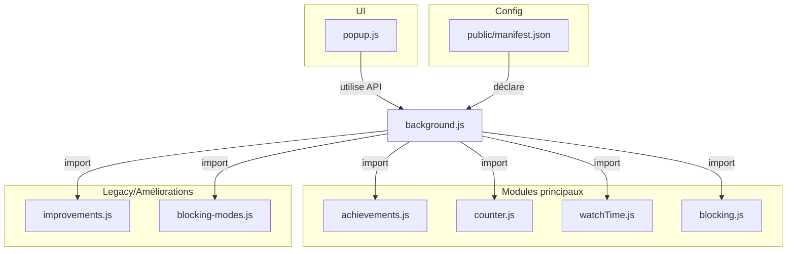

# YouTube Shorts Counter

Une extension de navigateur simple et efficace pour vous aider à reprendre le contrôle de votre temps sur YouTube. Elle compte les Shorts que vous visionnez et vous redirige en douceur après avoir atteint une limite fixée.

## Table des matières

- [À propos du projet](#à-propos-du-projet)
- [Fonctionnalités actuelles](#fonctionnalités-actuelles)
- [Installation](#installation)
- [Contribuer](#contribuer)
- [Licence](#licence)

## À propos du projet

Le défilement infini des YouTube Shorts peut être une source de distraction majeure. Cette extension a été créée dans le but de promouvoir une consommation de contenu plus consciente en introduisant une limite douce au nombre de Shorts visionnés par session.

## Fonctionnalités actuelles

- **Compteur de Shorts** : Suit le nombre de vidéos "Shorts" que vous regardez.
- **Affichage sur l'icône** : Le nombre actuel est visible directement sur l'icône de l'extension.
- **Redirection automatique** : Après 10 Shorts, vous êtes redirigé vers la page d'accueil de YouTube.
- **Réinitialisation intelligente** : Le compteur se réinitialise lorsque vous quittez la section Shorts, vous permettant de recommencer plus tard.

## Installation

Pour installer l'extension localement depuis les sources :

1.  Clonez ou téléchargez ce dépôt sur votre machine.
2.  Ouvrez votre navigateur (testé sur Firefox) :
    -   Pour **Firefox**, naviguez vers `about:debugging`.
    -   Pour **Chrome/Edge**, naviguez vers `chrome://extensions`.
3.  Activez le mode développeur si ce n'est pas déjà fait.
4.  Cliquez sur "Charger un module temporaire" (Firefox) ou "Charger l'extension non empaquetée" (Chrome).
5.  Sélectionnez le fichier `manifest.json` à la racine de ce projet.

L'icône de l'extension devrait maintenant apparaître dans votre barre d'outils.

## Contribuer

Les contributions sont les bienvenues ! Si vous souhaitez ajouter une fonctionnalité ou corriger un bug, n'hésitez pas à ouvrir une Pull Request.

Pour des idées sur comment améliorer le projet, consultez notre [**Feuille de route (ROADMAP.md)**](./ROADMAP.md).

## Licence

Ce projet est distribué sous la licence MIT. Voir le fichier `LICENSE` pour plus d'informations.

## Structure technique et architecture

### Vue d'ensemble
L’extension **YouTube Shorts Counter** aide à limiter la consommation de Shorts sur YouTube grâce à un compteur, des redirections, des modes de blocage avancés, un système de streaks et d’achievements, et des statistiques détaillées.

### Fonctionnalités principales
- Compteur de Shorts avec badge sur l’icône
- Redirection automatique après une limite configurable
- Système de streaks (jours consécutifs sans dépasser la limite)
- Achievements (badges, notifications)
- Modes de blocage (doux, standard, strict, adaptatif)
- Statistiques (temps moyen, historique, graphiques)
- UI moderne (glassmorphism, responsive, animations)
- Paramètres avancés (limite, pause, mode)
- Logs de debug pour le troubleshooting

### Structure technique (modules principaux)
- `background.js` : cœur métier, gestion des événements, intégration des modules
- `achievements.js` : gestion des succès et notifications
- `counter.js` : logique du compteur, streaks, reset
- `watchTime.js` : tracking du temps de visionnage, calculs
- `blocking.js` : modes de blocage, redirections, gestion de la pause
- `improvements.js` : fonctionnalités avancées (streaks, analytics)
- `blocking-modes.js` : configuration et stratégies de blocage
- `popup.js` / `popup.html` : interface utilisateur
- `public/manifest.json` : déclaration de l’extension

### Stockage (chrome.storage.local)
```js
{
  shortsCount: number,           // Compteur de session
  maxShorts: number,             // Limite utilisateur (défaut : 10)
  pauseUntil: timestamp,         // Fin de la pause
  pauseDuration: number,         // Durée de la pause (minutes)
  dailyCounts: { "YYYY-MM-DD": number }, // Historique quotidien
  currentStreak: number,         // Streak actuel
  bestStreak: number,            // Meilleur streak
  totalWatchTime: number,        // Temps total passé
  unlockedAchievements: [],      // Achievements débloqués
  blockingMode: string,          // Mode de blocage actif
  // ... autres clés pour analytics, logs, etc.
}
```

### Schéma Mermaid de la structure


